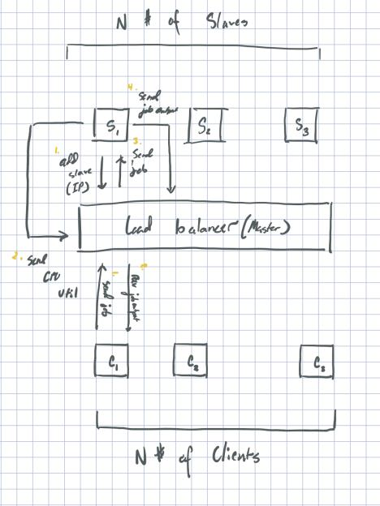

# Distributed Load Balancer

## What is '_Distributed Load Balancer_'? 🤔

The final group project I had to complete for my CSC 311 course on System Software.

## Problem Statement

Design and implement a distributed (centralized or decentralized) load balancing system for homogeneous cluster.

⚠️  _**Note**_: Please see [CSC 311 - Final Project](CSC_311_Final_Project.pdf) document for more details on the overall project specifications and requirements.

## Goals 🚀

The goal of this system is to design and implement a distributed centralized load balancing system for a homogeneous cluster, and therefore the architecture, as well as the design and the security of the system, must be given careful thought and consideration. The system at its core must be able to do the following tasks: 1) Add new node to the cluster, 2) Maintain a list of nodes currently active within the cluster, 3) Delegate a job to the most optimal node in the cluster, 4) Determine the most optimal node based on its CPU Utilization at a given time, 5) Request CPU Utilization from all active nodes to aid in the determination of the most optimal node, 6) Delegate tasks sent from a given client node to the optimal internal slave node in the system and communicate back to the client whom sent the request. Because of these tasks the system is required to perform, the goal of the overall system design must be taken from the perspective of efficiency and scalability. A load balancer must quickly and efficiently handle application traffic across a number of servers. This allows for increased reliability of client connections within the system and thus, allows a system to scale as its user-base increases.

⚠️  _**Note**_: Please see [my project report](report/final-project-report.pdf) for more detailed information as to the design of this system and its implications.

## Compiling

```shell script
gcc client.c -o client
gcc master.c -lpthread -o master
gcc slave.c -lpthread -o slave
gcc jobs/count-words/countwords.c -o jobs/count-words/countwords
```

## Running

On the central computer, from within the command-line run the following snippet after compiling the `master.c`.

```shell script
./master
```

On the subsequent nodes (either another virtual machine on the same network, or computers connected to the same switch), run the following snippet after compiling the `slave.c`.

```shell script
# ./slave <MASTER_IP_ADDRESS>
./slave "10.211.55.13"
```

On the respective client nodes either another virtual machine on the same network, or computers connected to the same switch), run the following snippet after compiling the `client.c`.

```shell script
# ./client <MASTER_IP_ADDRESS>
./client "10.211.55.13"
```

The client will prompt you to enter a job. Take a look at the below example of what a potential job looks like:

```shell script
# <PATH_TO_BINARY_EXECUTABLE> <PATH_TO_INPUT_FILE_FOR_BINARY_EXECUTABLE>
# jobs/countwords/countwords jobs/countwords/in.txt
```

This job is sent to the master node whereby it is passed off to the optimal slave for processing. The slave will then execute the program and return the output to Master where Master will pass the output back to the source client.

⚠️  _**Note**_: The `master` binary executable must be running before the `slave` or `client` binary's are executed, or else the slave and client nodes will fail to connect to the master node.

## Design Overview

<p align="center">
    <a href="report/images/system-architecture.png">
        
    </a>
</p>

Given the nature of such a system that is our goal to create the most optimal architecture is master-slave because each node in the cluster must both act as a client and server concurrently in order to achieve the desired results of the said system. However, we have chosen to maintain a centralized master-slave architecture rather than a decentralized system because of its efficiency, consistency, maintainability, and scalability. Having one node act as a reverse proxy for its clients rather than each node providing this said task has its benefits in that its simple and easier to implement and maintain over its counterpart. Additionally, because of this aspect, all nodes must first connect to this said centralized node which makes it easier to track and maintain the connections across the cluster. This improves scalability with the respect that we can simply just add another node to the cluster and the system should inherently handle the additional node. Centralized systems do have their downsides however; for example, it suffers from a single point of failure. If the central—or master—node in the cluster goes down, the individual “slave” machines attached to it are unable to process requests and send their output back to their source. However, on the flipside, decentralized networks require more machines, which means more maintenance and potential issues. Moreover, the implementation of the said network is much more difficult than a centralized system. In short, given the short time-span provided to us to complete this said project and the aforementioned advantages and disadvantages of centralization, the implementation of a centralized master-slave system was chosen.

## Modules

This system is comprised of three different, yet distinct modules: Client, Master, and Slave.

### Client

The client nodes are the respective devices that send jobs to the master node and wait for a response containing the output of the job sent. The clients are responsible for launching a job and waiting for its output to return from the master. The clients are not aware of the master’s slave or worker nodes. It can only communicate with the master node. The master node will handle the delegation of the job to the best worker or slave node and getting the output of said job back to the source client.

### Master

The master node in the cluster acts as the centralized node whereby all nodes communicate with. Essentially, it acts as a reverse proxy between the client nodes and the slave nodes. Because of this, every client node is not aware of any of the slave nodes and every slave node, is not aware of any client node. Thus, the master acts as an intermediary between the clients and the slaves nodes. The master has 7 different, yet distinct jobs: 1) Add a new node to the cluster, 2) Listen for CPU Utilization values sent from nodes within the cluster, 3) Maintain a determination of the most optimal node in the system based on each node’s CPU Utilization at a given time, 4) Listen for incoming client connections, 5) Process client connections, 6) Send a job to the most optimal node in the cluster and wait for the output of said job from the node the job was delegated to, 8) Send job output back to its associated client.

### Slave

The slave nodes are the individual hosts or other computers in the cluster that act as the workers of the system. They receive jobs, execute them, and report their output back to its source. They have 4 different, distinct jobs: 1) Connect to the master node to acknowledge that it’s alive and able to receive jobs 2) Send CPU Utilization to master every N amount of time 3) Listen for a job sent from the master node and add it to its job queue 4) execute each job that it was delegated in FIFO order and respond back to the master with the output of the completed jobs.

It’s important to consider how often the system receives each node’s CPU Utilization as it can have an impact on the overall system load with respect to the number of nodes in the cluster. If hundreds of slave nodes send their CPU Utilization every second, there would be a greater failure rate and load on the part of the master node. For this reason, it is imperative that we consider this factor with great care and consideration. Thus, in our system, we set a maximum random sleep time of 10 seconds to allow for a greater change in CPU Utilization. Moreover, the sleep time is random because it allows for variance in returned CPU Utilization values.

